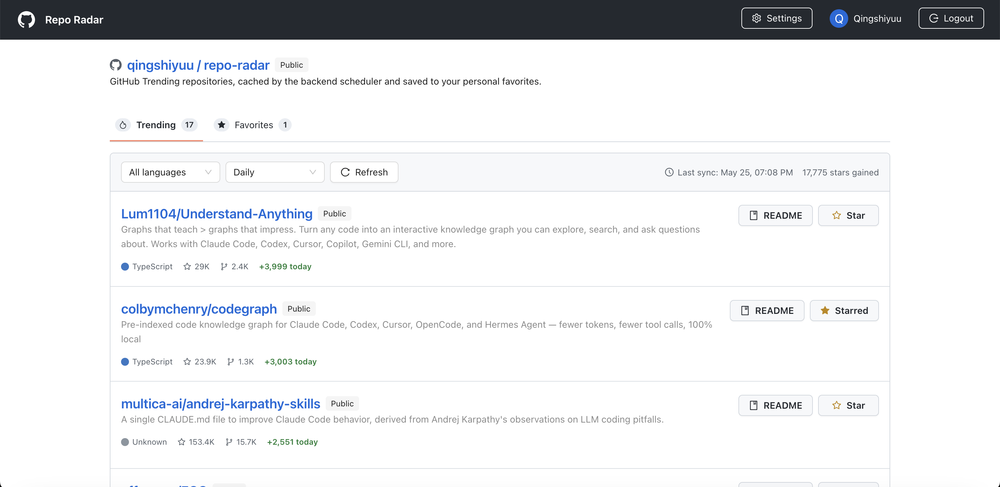
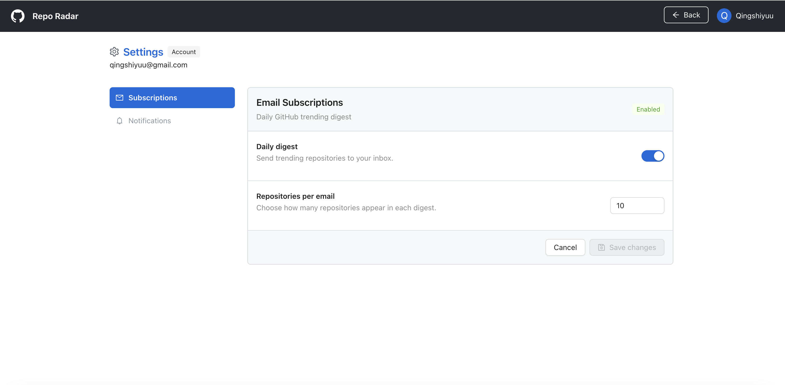
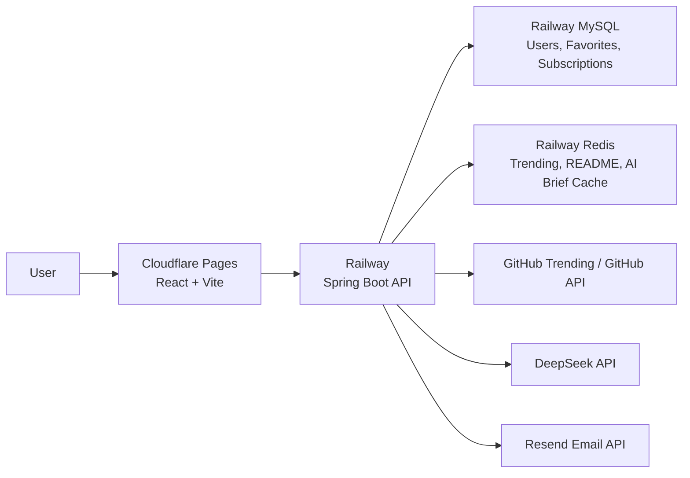

# Repo Radar

> A production-style GitHub Trending intelligence dashboard with README rendering, AI repo briefs, favorites, and email subscription settings.

<p>
  <a href="https://radar.qingshiyuu.com">
    
  </a>
  <a href="https://github.com/QingSH-J/github-trending-monitor">
    
  </a>
  
  
</p>

Repo Radar helps developers discover and understand trending GitHub repositories faster. It tracks GitHub Trending data, caches results on the backend, renders repository README files in a GitHub-like reading experience, and generates AI-powered repo summaries for quick evaluation.

The project is built as a real full-stack application, not just a frontend demo: authentication, favorites, Redis caching, MySQL persistence, cloud deployment, CORS, environment variables, and email subscription settings are all part of the system.

## Screenshots

### Trending Dashboard



### Email Subscription Settings



## Features

- **GitHub Trending dashboard** with language and time-range filters.
- **Backend scheduler** for scraping and caching trending repositories.
- **Favorites** so authenticated users can save interesting repositories.
- **README detail pages** with GitHub-flavored Markdown rendering.
- **AI repo briefs** generated from README content and cached to reduce API cost.
- **Email subscription settings** for future daily trending digest delivery.
- **JWT authentication** with email/password login.
- **GitHub OAuth login** support.
- **Cloud deployment** with Cloudflare Pages for frontend and Railway for backend.

## Tech Stack

| Layer | Tech |
| --- | --- |
| Frontend | React, Vite, Ant Design, Axios, React Router |
| Markdown | react-markdown, remark-gfm, rehype-raw, rehype-sanitize |
| Backend | Spring Boot, Spring Security, Spring Data JPA |
| Database | MySQL |
| Cache | Redis |
| Auth | JWT, GitHub OAuth2 |
| AI | DeepSeek-compatible OpenAI Java client |
| Email | Resend Java SDK, Thymeleaf templates |
| Deployment | Cloudflare Pages, Railway |

## Architecture



## Main API Surface

| Feature | Endpoint |
| --- | --- |
| Auth | `POST /api/auth/register`, `POST /api/auth/login` |
| User profile | `GET /api/user/profile` |
| Trending repos | `GET /api/trending`, `GET /api/trending/refresh` |
| Favorites | `GET /api/favorites`, `POST /api/favorites`, `DELETE /api/favorites` |
| README | `GET /api/repos/{owner}/{repo}/readme` |
| AI brief | `GET /api/repos/{owner}/{repo}/summary` |
| Email subscriptions | `GET /api/subscriptions`, `PUT /api/subscriptions` |

## Local Development

### Requirements

- Java 17+
- Node.js 20+
- MySQL
- Redis

### Backend

Create a local database:

```bash
mysql -uroot -p
CREATE DATABASE github_trending;
```

Run the Spring Boot backend:

```bash
export DATABASE_USERNAME=root
export DATABASE_PASSWORD=root123
export JPA_DDL_AUTO=update
export DEEPSEEK_API_KEY=your_deepseek_key
export RESEND_API_KEY=your_resend_key

./mvnw spring-boot:run
```

The backend runs on:

```txt
http://localhost:8080
```

### Frontend

```bash
cd frontend
npm install
npm run dev
```

The frontend runs on:

```txt
http://localhost:5173
```

For local development, the frontend defaults to:

```txt
VITE_API_BASE_URL=http://localhost:8080
```

## Environment Variables

### Backend

| Variable | Purpose |
| --- | --- |
| `DATABASE_URL` | JDBC URL for MySQL |
| `DATABASE_USERNAME` | MySQL username |
| `DATABASE_PASSWORD` | MySQL password |
| `REDIS_HOST` | Redis host |
| `REDIS_PORT` | Redis port |
| `REDIS_PASSWORD` | Redis password |
| `JWT_SECRET` | JWT signing secret |
| `GITHUB_CLIENT_ID` | GitHub OAuth client ID |
| `GITHUB_CLIENT_SECRET` | GitHub OAuth client secret |
| `DEEPSEEK_API_KEY` | AI summary provider key |
| `RESEND_API_KEY` | Resend email API key |
| `MAIL_FROM` | Sender email address |
| `MAIL_FROM_NAME` | Sender display name |
| `CORS_ALLOWED_ORIGINS` | Allowed frontend origins |
| `FRONTEND_OAUTH_REDIRECT_URL` | Frontend OAuth callback URL |

### Frontend

| Variable | Purpose |
| --- | --- |
| `VITE_API_BASE_URL` | Public backend API base URL |

## Deployment

The current deployment setup is:

```txt
Frontend: Cloudflare Pages
Backend: Railway
Database: Railway MySQL
Cache: Railway Redis
Domain: radar.qingshiyuu.com
```

Cloudflare Pages build settings:

```txt
Build command: cd frontend && npm ci && npm run build
Build output directory: frontend/dist
```

Railway backend settings:

```txt
Build command: ./mvnw -DskipTests package
Start command: java -Dserver.port=$PORT -jar target/*.jar
```

## Product Notes

Repo Radar is designed around one simple idea:

```txt
GitHub Trending shows what is hot.
Repo Radar helps decide what is worth your time.
```

Planned improvements:

- Daily trending email digest.
- Public unsubscribe endpoint.
- AI brief quota and rate limiting.
- Better repository maturity scoring.
- CI workflow for frontend lint/build and backend packaging.

## License

This project is currently developed as a personal full-stack learning and product-building project.
